# PLATEAU-SNAP-Server

「PLATEAU-SNAP-Server」は、デジタルツインの実現に向けたクラウドソーシング型 3D 都市モデル作成システム (PLATEAU SNAP) のバックエンドサーバーです。

## ソースコード

- ソースコード: [GitHub (Project-PLATEAU/PLATEAU-SNAP-Server)](https://github.com/Project-PLATEAU/PLATEAU-SNAP-Server)
